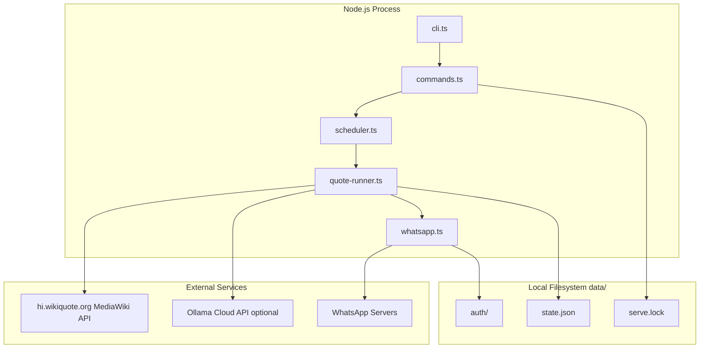
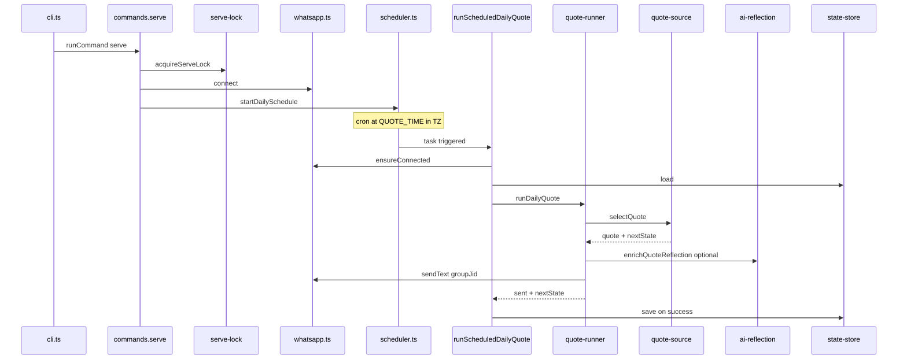
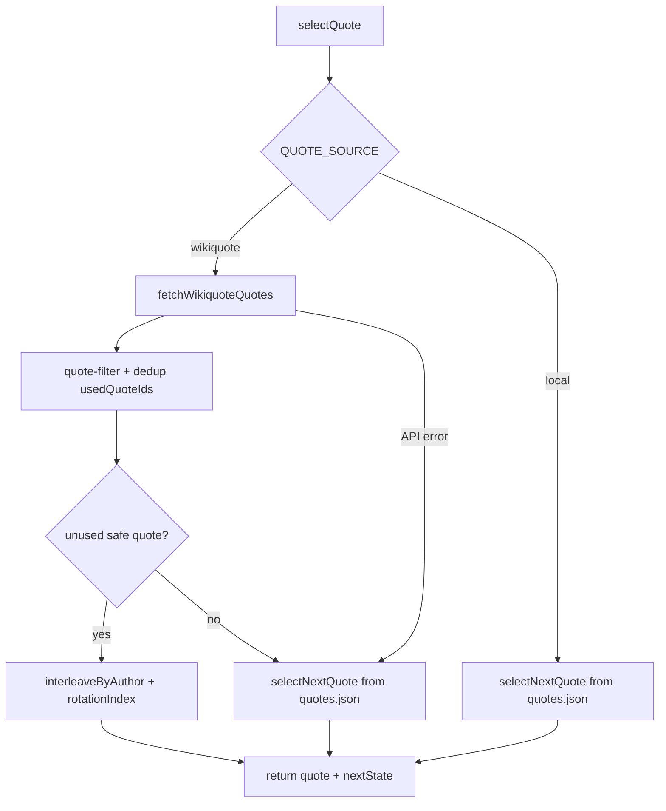

# wapp-quote Architecture

This document describes how the wapp-quote bot is structured. It is written for **developers and AI agents** making code changes. For setup, commands, and deployment walkthroughs, see [README.md](../README.md).

## Overview

wapp-quote is a **daily Hindi uplifting quote bot** for WhatsApp groups. It posts **one message per day** at a configured local time (default 06:00 IST), sourced from Hindi Wikiquote with a local fallback bank. It uses [Baileys](https://github.com/WhiskeySockets/Baileys) (WhatsApp Web protocol) and runs as a single Node.js process.

### Design constraints

These invariants are intentional. Do not break them without explicit product approval:

| Constraint | Where enforced | Why |
|------------|----------------|-----|
| Send-only — no inbound message handling | [`src/inbound-jid.ts`](../src/inbound-jid.ts) | Bot is a one-way broadcaster; Baileys skips decrypt for all JIDs |
| One message per calendar day | [`src/quote-runner.ts`](../src/quote-runner.ts) | `sentDates` keyed by `YYYY-MM-DD` in configured TZ |
| State saved only after WhatsApp accepts send | [`src/commands.ts`](../src/commands.ts) `runScheduledDailyQuote` | Prevents duplicate sends on restart after partial failure |
| Only one `serve` process at a time | [`src/serve-lock.ts`](../src/serve-lock.ts) | PID file at `data/serve.lock` |
| `send-now` / `list-groups` blocked while `serve` runs | [`src/serve-lock.ts`](../src/serve-lock.ts) `assertServeNotRunning` | Prevents one-shot commands from stealing the live WhatsApp session |

---

## System context



There is **no database**, message queue, or external cron. All persistence is JSON and Baileys multi-file auth on disk.

---

## Process model

### Entry point

[`src/cli.ts`](../src/cli.ts) is the sole entry point:

1. `loadConfig()` — Zod-validated env → `AppConfig`
2. `validateAiEnvironment()` — fail fast if AI enabled without API key
3. `BaileysWhatsAppSender` + `StateStore` constructed
4. `runCommand()` dispatched to [`src/commands.ts`](../src/commands.ts)

Production always runs:

```bash
node dist/src/cli.js serve
```

Used by `npm start`, Docker `CMD`, and Fly.io.

### CLI commands

| Command | Handler | Connects WA | Writes state | Notes |
|---------|---------|-------------|--------------|-------|
| `serve` | `serve()` | Yes, stays open | On successful send | Acquires serve lock; runs scheduler |
| `pair` | `pair()` | Yes, 30s then close | No | Clears auth first |
| `pair-qr` | `pair()` with `authMethod=qr` | Same | No | Writes `data/pairing-qr.svg` |
| `reset-auth` | `resetAuth()` | No | No | Deletes `data/auth/` |
| `list-groups` | `listGroups()` | Yes, then close | No | Asserts serve not running |
| `send-now` | `sendNow()` | Yes, then close | On success | `force: true`; asserts serve not running |
| `preview` | `preview()` | No | No | Prints next quote to stdout |
| `help` | `printHelp()` | No | No | Default when no command given |

---

## Module map

Dependency direction: **`commands` orchestrates** → **`quote-runner`** (idempotent send) → **`quote-source`** (selection) → **`wikiquote` / `quotes`**. The `WhatsAppSender` interface in [`src/types.ts`](../src/types.ts) allows test doubles.

### CLI / orchestration

| File | Responsibility | Edit when |
|------|----------------|-----------|
| [`src/cli.ts`](../src/cli.ts) | Parse argv, bootstrap deps, exit codes | Adding a new top-level command |
| [`src/commands.ts`](../src/commands.ts) | All command handlers; wires scheduler, pairing, send flows | Changing command behavior or retry policy |

### Config / types / logging

| File | Responsibility | Edit when |
|------|----------------|-----------|
| [`src/config.ts`](../src/config.ts) | Zod env schema → `AppConfig` | Adding/changing env vars |
| [`src/types.ts`](../src/types.ts) | `Quote`, `BotState`, `WhatsAppSender` | Changing core data shapes |
| [`src/logger.ts`](../src/logger.ts) | Pino logger factory | Changing log format or defaults |

### Scheduling

| File | Responsibility | Edit when |
|------|----------------|-----------|
| [`src/scheduler.ts`](../src/scheduler.ts) | `node-cron` daily trigger, catch-up polling, in-flight guard | Changing schedule or retry timing |
| [`src/date.ts`](../src/date.ts) | TZ-aware date keys, cron expression, catch-up window (4h default) | Changing date logic or grace period |
| [`src/serve-lock.ts`](../src/serve-lock.ts) | PID file lock for single `serve` instance | Changing concurrency rules |

### Quote pipeline

| File | Responsibility | Edit when |
|------|----------------|-----------|
| [`src/quote-source.ts`](../src/quote-source.ts) | Wikiquote vs local selection, dedup, fallback | Changing selection strategy |
| [`src/wikiquote.ts`](../src/wikiquote.ts) | MediaWiki API fetch, wikitext parsing | Changing Wikiquote integration |
| [`src/quotes.ts`](../src/quotes.ts) | Local bank load, round-robin, interleave-by-author | Changing local rotation |
| [`src/approved-authors.ts`](../src/approved-authors.ts) | Built-in approved Wikiquote page list (~50 authors) | Adding trusted Wikiquote sources |
| [`src/quote-filter.ts`](../src/quote-filter.ts) | Morning-suitability and safety filters | Changing quote acceptance rules |
| [`src/ai-reflection.ts`](../src/ai-reflection.ts) | Optional Ollama Cloud reflection generation | Changing AI enrichment |

### Messaging

| File | Responsibility | Edit when |
|------|----------------|-----------|
| [`src/whatsapp.ts`](../src/whatsapp.ts) | Baileys connect, send, reconnect, list groups | Changing WhatsApp behavior |
| [`src/message.ts`](../src/message.ts) | Hindi message template rendering | Changing output format |
| [`src/inbound-jid.ts`](../src/inbound-jid.ts) | Tell Baileys to ignore inbound decrypt | Rarely — send-only design |

### State / idempotency

| File | Responsibility | Edit when |
|------|----------------|-----------|
| [`src/state-store.ts`](../src/state-store.ts) | Atomic JSON read/write for `state.json` | Changing persistence format |
| [`src/quote-runner.ts`](../src/quote-runner.ts) | Idempotent daily send primitive | Changing skip/send logic or send retries |

### Data / scripts

| File | Responsibility | Edit when |
|------|----------------|-----------|
| [`src/data/quotes.json`](../src/data/quotes.json) | Curated local fallback quotes | Adding/editing fallback quotes |
| [`src/scripts/validate-quotes.ts`](../src/scripts/validate-quotes.ts) | CI/dev validation of local bank | Changing validation rules |

---

## Runtime flows

### Flow A: `serve` (production)



**Retry layers:**

1. **Send-level** ([`quote-runner.ts`](../src/quote-runner.ts)): 3 attempts, 1s / 2s backoff before throwing
2. **Schedule-level** ([`commands.ts`](../src/commands.ts) `runScheduledDailyQuote`): up to 3 attempts, 5 min apart; aborts early if today's date already in `sentDates` or session logged out

**Scheduler details** ([`scheduler.ts`](../src/scheduler.ts)):

- Primary trigger: `node-cron` at `QUOTE_TIME` in `TZ`
- `missedExecutionTolerance`: 5 minutes (node-cron `execution:missed` event)
- Catch-up poll: every 15 minutes if `QUOTE_CATCH_UP=true` and today's quote not sent
- Catch-up window: 4 hours after `QUOTE_TIME` ([`date.ts`](../src/date.ts) `DEFAULT_CATCH_UP_GRACE_HOURS`); e.g. 06:00 schedule → eligible until 10:00
- `noOverlap: true` + `sendInFlight` guard prevents concurrent sends

On SIGINT/SIGTERM, `serve` releases the serve lock and exits.

### Flow B: quote selection



- `usedQuoteIds` tracks last 1000 sent IDs to avoid repeats
- `rotationIndex` advances round-robin position
- Wikiquote modes (`WIKIQUOTE_MODE`): `pages` (approved list, recommended), `authors` (category random), `any` (random page)

### Flow C: pairing

1. `pair` / `pair-qr` calls `resetAuth()` — deletes `data/auth/`
2. `sender.connect()` — Baileys pairing code or QR
3. Process stays alive 30 seconds to persist credentials
4. `sender.close()` — one-shot command exits

QR mode also writes `data/pairing-qr.svg`. After re-pairing on Fly.io, restart the machine so `serve` loads the new session.

---

## Data model

### Core types ([`src/types.ts`](../src/types.ts))

```typescript
type Quote = {
  id: string;
  text: string;
  author: string;
  language: 'hi' | 'ur';
  mood: 'inspirational' | 'wisdom' | 'devotional' | 'hopeful';
  reflection: string;
  source?: string;
};

type BotState = {
  rotationIndex: number;
  usedQuoteIds: string[];  // last 1000 kept
  sentDates: Record<string, { quoteId: string; sentAt: string; messageId?: string }>;
};

interface WhatsAppSender {
  connect(): Promise<void>;
  ensureConnected(): Promise<void>;
  isConnected(): boolean;
  isLoggedOut(): boolean;
  close(): Promise<void>;
  sendText(jid: string, text: string): Promise<SendResult>;
  listGroups(): Promise<Array<{ jid: string; subject: string; participants: number }>>;
}
```

`dateKey` in `sentDates` is `YYYY-MM-DD` in the configured `TZ` ([`date.ts`](../src/date.ts) `localDateKey`).

### Filesystem layout

All paths relative to `DATA_DIR` (default `./data`):

| Path | Contents | Backup priority |
|------|----------|-----------------|
| `auth/` | Baileys multi-file session credentials | Critical — required to stay connected |
| `state.json` | `BotState` — rotation, used IDs, sent dates | High — prevents duplicate sends |
| `serve.lock` | `{pid}\n{startedAt}` — active serve process | Ephemeral — safe to remove if stale |
| `pairing-qr.svg` | QR code artifact (qr auth mode) | Ephemeral |

---

## Message format

Rendered by [`src/message.ts`](../src/message.ts):

```
🌅 सुप्रभात

✨ आज की पंक्ति
“{quote.text}”
— {author}

🌿 आज की दिशा: {reflection}
```

When `AI_PROVIDER=ollama-cloud`, [`src/ai-reflection.ts`](../src/ai-reflection.ts) may rewrite **only** the reflection line (`आज की दिशा`). Quote text and author are never modified. On AI failure or validation error, the built-in reflection from the quote source is used.

---

## Configuration

Config is loaded via `dotenv` + Zod in [`src/config.ts`](../src/config.ts). Invalid env fails fast at startup with field-level errors.

See [`.env.example`](../.env.example) for the canonical full list. Grouped summary:

| Concern | Key variables | Defaults |
|---------|---------------|----------|
| WhatsApp target | `WHATSAPP_GROUP_JID` | — (required for send) |
| Quote source | `QUOTE_SOURCE`, `WIKIQUOTE_*` | `wikiquote`, `pages` mode, `hi` language |
| Schedule | `QUOTE_TIME`, `TZ`, `QUOTE_CATCH_UP` | `06:00`, `Asia/Kolkata`, `true` |
| Auth | `AUTH_METHOD`, `PAIRING_PHONE_NUMBER` | `pairing` |
| Paths | `DATA_DIR`, `AUTH_DIR`, `STATE_FILE` | `./data`, `./data/auth`, `./data/state.json` |
| AI | `AI_PROVIDER`, `OLLAMA_*`, `AI_TIMEOUT_MS` | `none` |
| Logging | `LOG_LEVEL` | `info` |
| Deploy reset | `RESET_AUTH_ON_START`, `RESET_AUTH_TOKEN` | `false` |

Fly.io production overrides many defaults in [`fly.toml`](../fly.toml); secrets (`PAIRING_PHONE_NUMBER`, `WHATSAPP_GROUP_JID`, `OLLAMA_API_KEY`) are set via `fly secrets set`.

---

## Deployment topologies

| Target | How to run | Persistent data |
|--------|------------|-----------------|
| Local dev | `npm run dev -- <command>` (tsx) | `./data` |
| Production (bare) | `npm run build && npm start` | `./data` |
| Docker Compose | `docker compose up` — see [`docker-compose.yml`](../docker-compose.yml) | Volume `./data:/app/data` |
| Fly.io | `fly deploy` — see [`fly.toml`](../fly.toml) | Volume `wapp_quote_data` → `/app/data` |

The scheduler runs **in-process** via `node-cron`. There is no external cron job or Fly Cron.

Docker build: multi-stage Node 22, compiles TypeScript to `dist/`, copies `src/data/quotes.json`.

---

## Testing map

Vitest tests serve as behavioral specs. Run with `npm test`.

| Area | Test file |
|------|-----------|
| Scheduler / catch-up | `test/scheduler.test.ts`, `test/date.test.ts` |
| Quote selection | `test/quote-source.test.ts`, `test/quotes.test.ts` |
| Idempotent send | `test/quote-runner.test.ts` |
| Wikiquote parsing | `test/wikiquote.test.ts` |
| Quote filters | `test/quote-filter.test.ts` |
| Approved authors | `test/approved-authors.test.ts` |
| Serve lock | `test/serve-lock.test.ts` |
| Config validation | `test/config.test.ts` |
| Message template | `test/message.test.ts` |
| AI reflection | `test/ai-reflection.test.ts` |
| Inbound JID ignore | `test/inbound-jid.test.ts` |
| State store | `test/state-store.test.ts` |
| Commands | `test/commands.test.ts` |
| Logger | `test/logger.test.ts` |

Additional checks: `npm run typecheck`, `npm run validate:quotes`.

---

## Agent cheat sheet

| If you need to… | Edit |
|-----------------|------|
| Change send time or catch-up window | `src/date.ts`, `src/scheduler.ts`, env `QUOTE_TIME` / `QUOTE_CATCH_UP` |
| Add Wikiquote authors | `src/approved-authors.ts` or env `WIKIQUOTE_PAGES` |
| Change message template | `src/message.ts` |
| Add local fallback quotes | `src/data/quotes.json`, then `npm run validate:quotes` |
| Change quote safety rules | `src/quote-filter.ts` |
| Change WhatsApp connect/reconnect | `src/whatsapp.ts` |
| Add a CLI command | `src/commands.ts` + `knownCommands` in `src/cli.ts` |
| Change idempotency / state shape | `src/quote-runner.ts`, `src/state-store.ts`, `src/types.ts` |
| Change env vars | `src/config.ts`, `.env.example` |
| Change selection / fallback logic | `src/quote-source.ts` |
| Change AI reflection behavior | `src/ai-reflection.ts` |

---

## Operational pitfalls

- **Re-pairing**: use `reset-auth` or `pair` (both clear `data/auth/`). For one-time deploy reset, set `RESET_AUTH_ON_START=true`. After re-pairing, restart `serve` (e.g. `fly machine restart`).
- **Session conflict (Baileys status 440)**: `whatsapp.ts` waits 10s before reconnecting.
- **Never run `send-now` or `list-groups` while `serve` is active** — they will fail with a serve-lock error, or worse, steal the session if the lock is stale.
- **Stale serve lock**: if the PID in `serve.lock` is dead, the next `serve` or one-shot command will clear it automatically.
- **Back up `data/auth/` and `data/state.json`** before server migration or destructive changes.
- **Restarts are safe**: if today's quote was already sent, `runDailyQuote` returns `skipped` and does not resend.

---

## Dependencies

Runtime (see [`package.json`](../package.json)):

| Package | Role |
|---------|------|
| `@whiskeysockets/baileys` | WhatsApp Web client |
| `node-cron` | In-process daily scheduler |
| `pino` | Structured logging |
| `zod` | Env validation |
| `dotenv` | Load `.env` |
| `qrcode` / `qrcode-terminal` | QR pairing |

Node.js >= 20 required (Docker uses Node 22).
