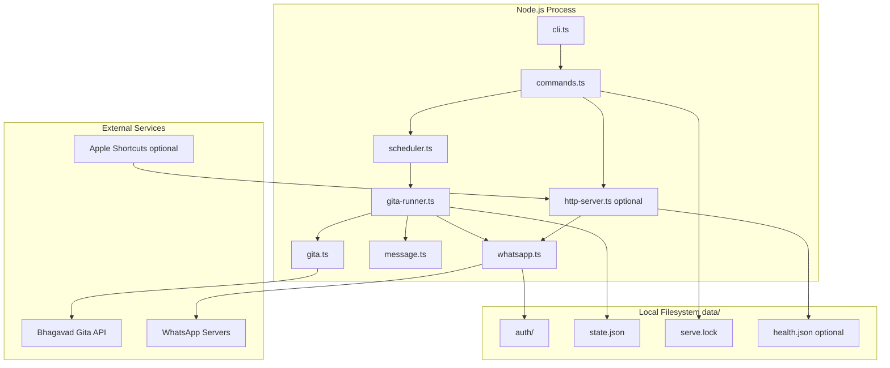
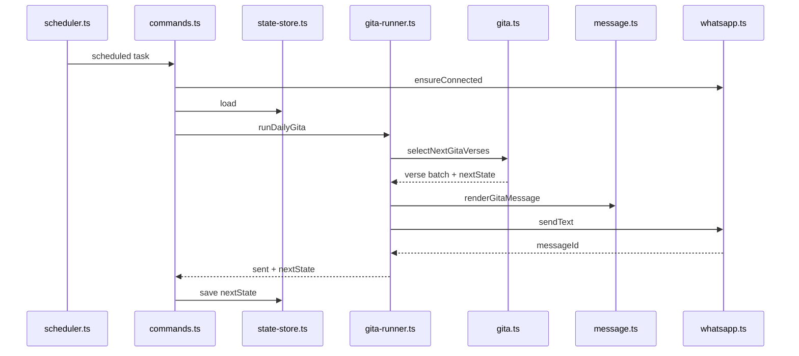

# wapp-quote Architecture

This document is for developers and agents working on the bot. For setup and deployment, see [README.md](../README.md).

## Overview

wapp-quote sends the next Bhagavad Gita shlokas with Hindi भावार्थ to a WhatsApp group each day. By default it sends two consecutive shlokas per day, fetched from a public API at send time. There is no legacy quote bank, Wikiquote integration, or AI reflection pipeline.

The process is a single Node.js app using [Baileys](https://github.com/WhiskeySockets/Baileys). Persistence is JSON files plus Baileys auth files under `data/`.

An optional health webhook can run in the same process and reuse the same WhatsApp session.

## Invariants

| Constraint | Where enforced | Why |
|------------|----------------|-----|
| Send-only — no inbound WhatsApp handling | [`src/inbound-jid.ts`](../src/inbound-jid.ts) | One-way broadcaster; Baileys skips decrypt for all JIDs |
| One Gita message per calendar day | [`src/gita-runner.ts`](../src/gita-runner.ts) | `sentDates` keyed by `YYYY-MM-DD` in configured TZ |
| Cursor advances only after send acceptance | [`src/gita-runner.ts`](../src/gita-runner.ts), [`src/commands.ts`](../src/commands.ts) | Avoids skipping verses after API/send failures |
| Only one `serve` process at a time | [`src/serve-lock.ts`](../src/serve-lock.ts) | Protects the WhatsApp session |
| Health webhook shares the live WhatsApp session | [`src/http-server.ts`](../src/http-server.ts) | A second process would conflict with Baileys auth |

## System context


```mermaid
graph TB
    subgraph process [Node.js Process]
        CLI[cli.ts]
        CMD[commands.ts]
        SCH[scheduler.ts]
        RUN[gita-runner.ts]
        GITA[gita.ts]
        MSG[message.ts]
        WA[whatsapp.ts]
        HTTP[http-server.ts optional]
    end

    subgraph storage [Local Filesystem data/]
        AUTH[auth/]
        STATE[state.json]
        LOCK[serve.lock]
        HEALTH[health.json optional]
    end

    subgraph external [External Services]
        API[Bhagavad Gita API]
        WANET[WhatsApp Servers]
        SHORT[Apple Shortcuts optional]
    end

    CLI --> CMD
    CMD --> SCH
    SCH --> RUN
    RUN --> GITA
    GITA --> API
    RUN --> MSG
    RUN --> WA
    WA --> AUTH
    WA --> WANET
    RUN --> STATE
    CMD --> LOCK
    CMD --> HTTP
    SHORT --> HTTP
    HTTP --> HEALTH
    HTTP --> WA
```

## Process model

[`src/cli.ts`](../src/cli.ts) is the entry point:

1. `loadConfig()` parses env into `AppConfig`.
2. `validateHealthEnvironment()` validates optional health settings.
3. `BaileysWhatsAppSender` and `StateStore` are constructed.
4. `runCommand()` dispatches to [`src/commands.ts`](../src/commands.ts).

Production runs:

```bash
node dist/src/cli.js serve
```

## Commands

| Command | Connects WA | Writes state | Notes |
|---------|-------------|--------------|-------|
| `serve` | Yes, stays open | On successful scheduled send | Acquires serve lock; starts scheduler |
| `send-now` | Yes, then closes | On successful send | Forces send for today |
| `preview` | No | No | Fetches and prints next Gita message |
| `list-groups` | Yes, then closes | No | Blocked while `serve` runs |
| `pair` / `pair-qr` | Yes, then closes | No | Resets auth first |
| `reset-auth` | No | No | Deletes `data/auth/` |
| `help` | No | No | Prints usage |

## Module map

| File | Responsibility |
|------|----------------|
| [`src/config.ts`](../src/config.ts) | Env schema and validation helpers |
| [`src/types.ts`](../src/types.ts) | Core state, Gita verse batch, WhatsApp sender types |
| [`src/gita.ts`](../src/gita.ts) | Gita verse counts, cursor math, batch selection, API fetch, normalization, validation |
| [`src/gita-runner.ts`](../src/gita-runner.ts) | Idempotent daily Gita send primitive |
| [`src/message.ts`](../src/message.ts) | Gita WhatsApp message renderer |
| [`src/commands.ts`](../src/commands.ts) | CLI command orchestration and scheduled retry loop |
| [`src/scheduler.ts`](../src/scheduler.ts) | Cron trigger and catch-up polling |
| [`src/date.ts`](../src/date.ts) | Timezone date keys and catch-up window logic |
| [`src/state-store.ts`](../src/state-store.ts) | Atomic `state.json` load/save and migration |
| [`src/whatsapp.ts`](../src/whatsapp.ts) | Baileys connection, send, reconnect, group listing |
| [`src/inbound-jid.ts`](../src/inbound-jid.ts) | Send-only inbound decrypt skip |
| [`src/serve-lock.ts`](../src/serve-lock.ts) | Single `serve` process lock |
| [`src/http-server.ts`](../src/http-server.ts) | Optional health webhook |
| [`src/health-*`](../src) | Health payload schema, state, and Hindi report rendering |

## Gita sequence and state

State shape:

```ts
type BotState = {
  gitaCursor: number;
  sentDates: Record<string, { verseIds: string[]; label: string; sentAt: string; messageId?: string }>;
};
```

`gitaCursor` is zero-based. `0` means Chapter 1, Verse 1. Canonical verse counts are hard-coded in [`src/gita.ts`](../src/gita.ts):

```ts
[47, 72, 43, 42, 29, 47, 30, 28, 34, 42, 55, 20, 35, 27, 20, 24, 28, 78]
```

`GITA_VERSES_PER_DAY` defaults to `2`, so the cursor usually advances by two after a successful send. After 18.78, the cursor wraps to 1.1.

## API handling

[`src/gita.ts`](../src/gita.ts) fetches each verse in the daily batch:

```text
{GITA_API_BASE_URL}/slok/{chapter}/{verse}/
```

Each response must contain:

- requested chapter/verse
- non-empty Sanskrit shloka text
- non-empty Hindi meaning with Devanagari text

`GITA_HINDI_FIELD` defaults to `tej.ht`. If that field is absent or invalid, the normalizer searches for the first valid Hindi meaning field. If validation fails, the send attempt fails; no fallback content is sent.

## Send flow


```mermaid
sequenceDiagram
    participant Sch as scheduler.ts
    participant Cmd as commands.ts
    participant Store as state-store.ts
    participant Run as gita-runner.ts
    participant Gita as gita.ts
    participant Msg as message.ts
    participant WA as whatsapp.ts

    Sch->>Cmd: scheduled task
    Cmd->>WA: ensureConnected
    Cmd->>Store: load
    Cmd->>Run: runDailyGita
    Run->>Gita: selectNextGitaVerses
    Gita-->>Run: verse batch + nextState
    Run->>Msg: renderGitaMessage
    Run->>WA: sendText
    WA-->>Run: messageId
    Run-->>Cmd: sent + nextState
    Cmd->>Store: save nextState
```

Retry layers:

1. `gita-runner.ts`: WhatsApp send retry, 3 attempts with 1s/2s backoff.
2. `commands.ts`: scheduled attempt retry, 3 attempts with 5 minutes between attempts.
3. `scheduler.ts`: catch-up polling until the 4-hour window expires.

## Message format

```text
🌅 सुप्रभात

🕉️ श्रीमद्भगवद्गीता {start}–{end}
{sanskrit shloka 1}

{sanskrit shloka 2}

📖 भावार्थ:
{chapter.verse} — {hindi meaning 1}

{chapter.verse} — {hindi meaning 2}
```

## Data files

| Path | Purpose | Criticality |
|------|---------|-------------|
| `data/auth/` | Baileys session credentials | High |
| `data/state.json` | Gita cursor and sent dates | High |
| `data/serve.lock` | Active serve PID | Ephemeral |
| `data/health.json` | Health webhook state, when enabled | Medium/high |

## Tests

| Area | Test file |
|------|-----------|
| Config | `test/config.test.ts` |
| Date/scheduler | `test/date.test.ts`, `test/scheduler.test.ts` |
| Gita API/cursor | `test/gita.test.ts` |
| Daily send primitive | `test/gita-runner.test.ts` |
| Message renderer | `test/message.test.ts` |
| State store | `test/state-store.test.ts` |
| Commands | `test/commands.test.ts` |
| WhatsApp/inbound | `test/inbound-jid.test.ts` |
| Health webhook | `test/health-*.test.ts`, `test/http-server.test.ts` |

Run:

```bash
npm test
npm run typecheck
npm run build
```

## Common changes

| Change | Files |
|--------|-------|
| Change Gita API normalization | `src/gita.ts`, `test/gita.test.ts` |
| Change message template | `src/message.ts`, `test/message.test.ts` |
| Change idempotency/state | `src/gita-runner.ts`, `src/state-store.ts`, `src/types.ts` |
| Change scheduling/catch-up | `src/scheduler.ts`, `src/date.ts`, `test/scheduler.test.ts` |
| Change env vars | `src/config.ts`, `.env.example`, README |
| Change health webhook | `src/http-server.ts`, `src/health-*` |

## Operational notes

- Back up `data/auth/` and `data/state.json` before server migration.
- Restarts are safe: if today's Gita message was recorded, it will not resend unless `send-now` is used.
- If the Gita API is down or invalid, the bot skips/fails the attempt rather than sending stale content.
- `send-now` and `list-groups` are blocked while `serve` runs to avoid WhatsApp session conflicts.
